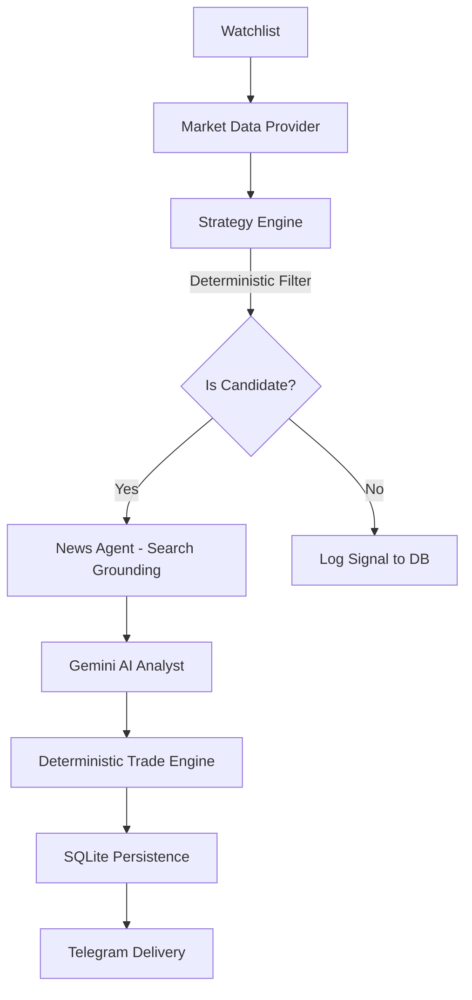

# 💹 Swing Scanner (NSE)
[](https://www.python.org/downloads/)
[](https://opensource.org/licenses/MIT)
[](https://www.nseindia.com/)
[](https://www.digitalocean.com/)

A professional-grade, AI-powered swing-trade candidate scanner for the Indian Equities market (NSE). This tool bridges the gap between **deterministic quantitative filters** and **probabilistic AI reasoning**, delivering high-probability trade setups directly to your Telegram.


---

## 🌟 Why This Project?

Most trading bots are either purely technical (missing market context) or purely AI-based (hallucinating price levels). **Swing Scanner** solves this with a multi-layered architecture:

1.  **Quantitative Filter:** A high-performance engine scans thousands of data points to identify setups with specific RSI, MACD, and Bollinger Band characteristics.
2.  **Agentic Intelligence:** On detection, an AI Agent (Gemini 2.5 Flash) performs real-time Google Search grounding to understand *why* the stock is moving (earnings, news, sector tailwinds).
3.  **Deterministic Engine:** Trade levels (Entry, Target, Stop-Loss) are calculated using robust mathematical models, ensuring the AI never "invents" a price.

---

## ✨ Key Features

### 🧠 Grounded AI Analysis
Uses **Gemini 2.5 Flash** with search grounding to provide structured analyst-grade commentary. It evaluates:
- **Momentum & Trend:** RSI, MACD, and EMA relationship.
- **Volume Quality:** Relative volume vs. 20-bar averages.
- **Risk Assessment:** Real-time news catalysts and invalidation triggers.

### 🕒 NSE-Specific Intelligence
Automated scheduling aligned with the Indian market lifecycle:
- **09:20 IST:** Opening momentum scan (5m after open).
- **12:27 IST:** Mid-market stability check.
- **15:15 IST:** Closing window for EOD setups.

### 🗄️ Persistent Intelligence
Integrated **SQLite Persistence** records every scan, signal, and AI thesis. This creates a rich dataset for:
- Historical lookback of trade ideas.
- Win-rate and performance tracking.
- Quantitative backtesting of the "AI Thesis" vs. actual outcomes.

### ⚡ Parallelized Performance
Built with `ThreadPoolExecutor`, the scanner can process a 50+ symbol watchlist in seconds, ensuring you never miss a fast-moving setup.

---

## 🛠️ Tech Stack

- **Core:** Python 3.11+
- **Quantitative:** Pandas, TA-Lib (or fallback), yfinance
- **AI:** Google Gemini 2.5 Flash (via API)
- **Database:** SQLite3
- **Delivery:** Telegram Bot API
- **Networking:** Pure `urllib` (Zero third-party HTTP dependencies for minimal overhead)
- **Deployment:** DigitalOcean Droplet (Ubuntu/Linux)

---

## 🏗️ Architecture



---

## 🚀 Quick Start

### 1. Installation
```bash
git clone https://github.com/yourusername/swing_scanner.git
cd swing_scanner
python -m venv .venv
.\.venv\Scripts\activate
pip install -r requirements.txt
```

### 2. Configuration
Create a `.env` file from the example:
```bash
GEMINI_API_KEY=your_google_ai_studio_key
TELEGRAM_BOT_TOKEN=your_bot_token
TELEGRAM_CHAT_ID=your_chat_id
```

### 3. Usage
```powershell
# Run a single scan on the example watchlist
python -m swing_scanner.app --watchlist .\watchlist.example.txt --run-once

# Start the market-hours scheduler
python -m swing_scanner.app --watchlist .\watchlist.example.txt
```

---

## ☁️ Deployment

The system is designed for **24/7 automated operation** and is currently deployed on a **DigitalOcean Droplet**.

- **Environment:** Ubuntu 22.04 LTS
- **Process Management:** `systemd` or `screen` for persistent background execution.
- **Automation:** Uses the internal `scheduler.py` aligned with NSE market hours (09:20, 12:27, 15:15 IST).
- **Uptime Monitoring:** Real-time heartbeats sent via Telegram.

---

## 🧪 Testing

We maintain a high-quality codebase with 18+ comprehensive tests covering persistence, scheduling, and AI logic.

```powershell
python -m unittest discover -s tests -v
```

---

## 📋 Roadmap

- [x] **Persistence:** SQLite DB for historical lookback.
- [x] **NSE Scheduling:** Automation for Indian market hours.
- [ ] **FastAPI Backend:** REST API for mobile/web dashboards.
- [ ] **Multi-Broker Integration:** Native execution for Dhan, Zerodha, etc.

---

*Disclaimer: This is a tool for technical analysis. Trading involves risk. All trade ideas are generated for educational purposes and do not constitute financial advice.*

